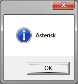
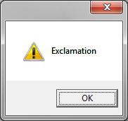
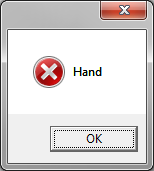
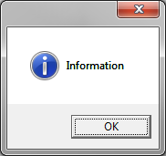
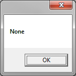
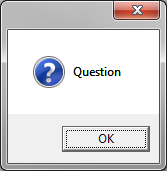
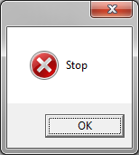
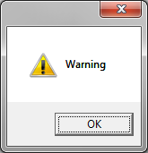

# C# MessageBoxIcon-Enumeration

Dialog Screenshots taken from Windows 7 64 Bit / .NET Framework 4.5.2

---

##### MessageBoxIcon.Asterisk

---

##### MessageBoxIcon.Error

---

##### MessageBoxIcon.Exclamation

---

##### MessageBoxIcon.Hand

---

##### MessageBoxIcon.Information

---

##### MessageBoxIcon.None

---

##### MessageBoxIcon.Question

---

##### MessageBoxIcon.Stop

---

##### MessageBoxIcon.Warning

